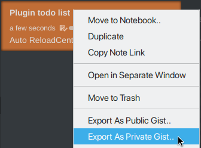

# Export As Gist plugin for Inkdrop

[](https://github.com/jmerle/inkdrop-export-as-gist/actions?query=workflow%3ABuild)
[](https://my.inkdrop.app/plugins/export-as-gist)
[](https://my.inkdrop.app/plugins/export-as-gist)
[](https://github.com/jmerle/inkdrop-export-as-gist/blob/master/LICENSE)



This plugin makes it possible to export Inkdrop notes as a GitHub gist.

## Install

```
ipm install export-as-gist
```

## Usage

Before attempting to export, make sure to set a valid personal access token with the `gist` scope in the plugin's settings. You can generate one at [https://github.com/settings/tokens/new](https://github.com/settings/tokens/new).

## Changelog

See the [GitHub releases](https://github.com/jmerle/inkdrop-export-as-gist/releases) for an overview of what changed in each update.

## Contributing

All contributions are welcome. Please read the [Contributing Guide](https://github.com/jmerle/inkdrop-export-as-gist/blob/master/CONTRIBUTING.md) first as it contains information regarding the tools used by the project and instructions on how to set up a development environment.
